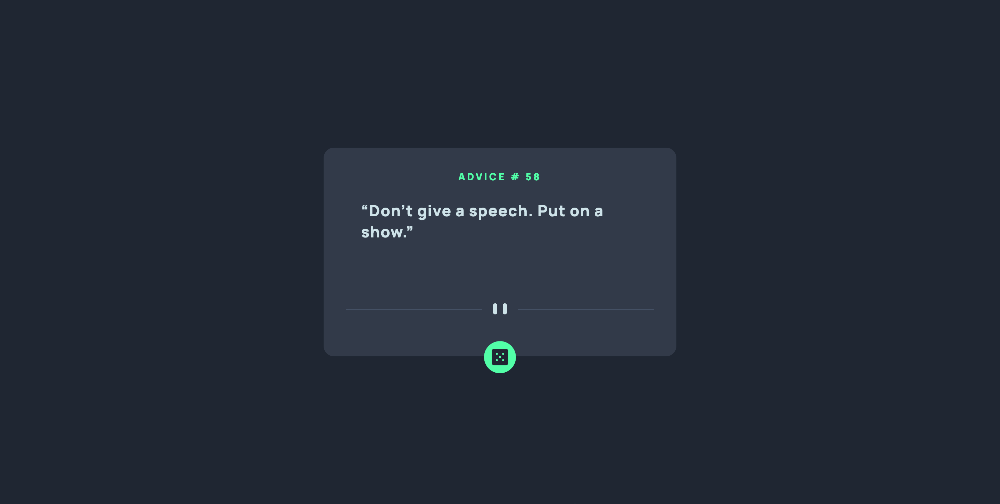

# Frontend Mentor - Advice generator app solution

This is a solution to the [Advice generator app challenge on Frontend Mentor](https://www.frontendmentor.io/challenges/advice-generator-app-QdUG-13db). Frontend Mentor challenges help you improve your coding skills by building realistic projects.

## Table of contents

- [Overview](#overview)
  - [The challenge](#the-challenge)
  - [Screenshot](#screenshot)
  - [Links](#links)
- [My process](#my-process)
  - [Built with](#built-with)
  - [What I learned](#what-i-learned)
  - [Useful resources](#useful-resources)
- [Author](#author)
## Overview

### The challenge

Users should be able to:
- See hover states for all interactive elements on the page
- Generate a new piece of advice by clicking the dice icon

### Screenshot



### Links

- Solution URL: [Add solution URL here](https://github.com/ttekie/advice-generator-app-main)
- Live Site URL: [](https://ttekie.github.io/advice-generator-app-main/)

## My process
### Built with
- Semantic HTML5 markup
- Sass 
- CSS Flexbox
- vanilla js

### What I learned
I utilized html, sass and vanilla js to work on this project. It was a good project to enhance my frontend coding skill. 

To see how you can add code snippets, see below:

```js
// event listener function
async function displayAdvice() {
   const response = await fetch(url); // send the http request 
   const data = await response.json(); // get the response and change it to a usable js object 
   console.log(data);
   span.innerHTML = data.slip.id;
   q.innerHTML = data.slip.advice;
}
// btn will be the element that fires the event and we added the 
// listener function that listens to the event fired by the target element
btn.addEventListener('click', displayAdvice);

function onPageLoad() { 
   displayAdvice();
}
onPageLoad();
```
### Useful resources

- [css tricks](https://css-tricks.com/) - While working on this project, css tricks was my number one to go to refresh my memory on css Grid and css flexbox property. css tricks one of the best css resources on the internet, I would definitely recommend it.
- [sass documentation](https://sass-lang.com/) - As this is my first time using sass on a project, sass documentation was the one I used to learn and refer sass properties.

## Author

- Website - [Tesfalem Tekie](https://ttekie.github.io/portfolio/#)
- Frontend Mentor - [@ttekie](https://www.frontendmentor.io/profile/ttekie)
- Github - [@ttekie](https://github.com/ttekie)

